# FaultMaven - Self-Hosted Deployment

> **Part of [FaultMaven](https://github.com/FaultMaven/faultmaven)** —
> The AI-Powered Troubleshooting Copilot

**An AI-powered troubleshooting copilot you can run anywhere for free.**

[](LICENSE)
[](https://hub.docker.com/u/faultmaven)

---

## Overview

This repository provides a complete Docker Compose deployment for self-hosting **FaultMaven**, an AI-powered troubleshooting copilot that helps you diagnose and resolve technical issues faster.

**📖 Resources:**
- **[Main Repository](https://github.com/FaultMaven/faultmaven)** — Architecture, contributing, system overview
- **[Product Overview](https://faultmaven.ai/product)** — See what FaultMaven can do
- **[Use Cases](https://faultmaven.ai/use-cases)** — Real-world troubleshooting scenarios
- **[Roadmap](https://faultmaven.ai/roadmap)** — What we're building next
- **[Beta Founders Program](https://faultmaven.ai/founders)** — Get free Enterprise Cloud access

**What you get with self-hosted deployment:**

- 🤖 **AI Troubleshooting Agent** - LangGraph-powered assistant with milestone-based investigation
- 📚 **3-Tier Knowledge Base** - Personal KB + Global KB + Case Working Memory
- 📊 **8 Data Type Support** - Logs, traces, profiles, metrics, config, code, text, visual
- 🗄️ **Portable SQLite Database** - Zero configuration, single file, easy backups
- 🔍 **Vector Search** - ChromaDB for semantic knowledge retrieval
- ⚙️ **Background Processing** - Celery + Redis for async operations
- 🧠 **Continuous Learning** - Every resolved case automatically indexes solutions for future reference

**Deploy with a single command.** First run downloads ~2-3GB of images (5-10 minutes). Subsequent starts take seconds.

---

## Why FaultMaven?

Your monitoring tools show **what** broke. Generic LLMs guess **why**, but can't see your infrastructure. FaultMaven bridges this gap—correlating your logs, configs, and code to deliver answers grounded in your actual system.

→ [See use cases](https://faultmaven.ai/use-cases) | [Product overview](https://github.com/FaultMaven/faultmaven)

---

## Who Is This For?

**✅ Self-Hosted is perfect for:**

- 👨‍💻 **Individual Engineers** - Personal troubleshooting assistant with your own knowledge base
- 🔬 **Developers & Tinkerers** - Study architecture, experiment with LLMs, RAG, and agentic workflows
- 🔐 **Privacy-Conscious Teams** - Keep sensitive data on-premises in air-gapped environments
- 🌍 **Open-Source Contributors** - Improve the product, add features, learn AI troubleshooting

**Need team collaboration, SSO, or case sharing?** Check out [Enterprise Cloud](https://faultmaven.ai/founders) — free during private beta.

---

## Quick Start

**⚡ Four Simple Steps:**

```bash
# 1. Install: Clone the repository
git clone https://github.com/FaultMaven/faultmaven-deploy.git
cd faultmaven-deploy

# 2. Configure: Add your settings
cp .env.example .env
# Edit .env and add:
#   - LLM API key (any provider: OPENAI_API_KEY, ANTHROPIC_API_KEY, GROQ_API_KEY, etc.)
#   - SERVER_HOST (your server IP, e.g., 192.168.0.200)

# 3. Protect: Resource limits (auto-created by wrapper)
# The ./faultmaven script handles this automatically

# 4. Run: Start everything with one command
./faultmaven start
# Docker automatically pulls pre-built images from Docker Hub
# Waits up to 120 seconds for all services to pass health checks
```

**Expected output:**

```text
✅ Docker is running
✅ System has 15.5 GB RAM (8 GB required)
✅ Environment file configured (.env)
✅ Resource limits configured

Starting Docker containers...
⏳ Waiting for services to become healthy (up to 120 seconds)...

✅ FaultMaven services started successfully!

Next steps:
  1. Check status:  ./faultmaven status
  2. View logs:     ./faultmaven logs
  3. Access services:
     - API Gateway: http://192.168.0.200:8090/docs
     - Dashboard:   http://192.168.0.200:3000
```

**If services don't start:** Run `./faultmaven logs` to see error details, or see [Troubleshooting](#troubleshooting) below.

**What happens during deployment:**

- Docker pulls pre-built container images from [Docker Hub](https://hub.docker.com/u/faultmaven)
- All 10 services use pre-built images (no building required)
- No local repositories needed - everything from Docker Hub
- First deployment downloads ~2-3GB of images (one-time)
- Future updates only download changed layers (faster)

### Prerequisites

**Required:**

- **Docker** & **Docker Compose** ([Get Docker](https://docs.docker.com/get-docker/))
- **8GB RAM** minimum (16GB recommended)
  - Default resource limits assume 8GB system RAM
  - Allocates ~5GB total: Agent (1.5GB), Knowledge (2GB), ChromaDB (1GB), Redis (512MB)
  - Remaining ~3GB for OS and other applications
  - **16GB+ systems:** Edit `docker-compose.override.yml` to increase limits for better performance
- **LLM API Key** - Choose one or more:
  - [OpenAI](https://platform.openai.com/api-keys) (GPT-4, GPT-3.5)
  - [Anthropic](https://console.anthropic.com/) (Claude)
  - [Groq](https://console.groq.com/) (FREE tier - ultra-fast!)
  - [Gemini](https://makersuite.google.com/app/apikey) (Google)
  - [Fireworks AI](https://fireworks.ai/api-keys) (Open source models)
  - [OpenRouter](https://openrouter.ai/keys) (Multi-provider aggregation)

### 🎯 **LLM Provider Options**

Self-hosted FaultMaven uses **one LLM for all operations** - chat, analysis, and knowledge base queries. You configure a single provider in `.env` and it handles everything.

**Available providers:**

- **Cloud LLMs**: OpenAI, Anthropic, Groq, Gemini, Fireworks, OpenRouter
- **Local LLMs**: Ollama, LM Studio, LocalAI, vLLM

#### Cloud LLM (Recommended)

- ✅ Fastest response (1-2 seconds)
- ✅ Best reasoning quality
- ✅ No local hardware needed
- 💰 ~$0.10-$0.50 per session

#### Local LLM (Full data sovereignty)

- ✅ Zero API costs
- ✅ Air-gapped capable (offline)
- ✅ Complete data control
- ⚙️ Requires 8GB+ RAM (16GB+ recommended)
- ⏱️ Slower (5-15 seconds vs 1-2 seconds)

**What runs locally:**

- ✅ 10 Docker containers: 6 microservices + API Gateway + Dashboard + 2 job workers
  - **Microservices**: auth, session, case, knowledge, evidence, agent
  - **API Gateway**: Single entry point for all requests
  - **Dashboard**: Web UI for Global KB management
  - **Job Workers**: Celery worker + Celery Beat scheduler
- ✅ ChromaDB vector database
- ✅ Redis session store
- ✅ SQLite data storage

---

## Using the CLI Wrapper

The `./faultmaven` script simplifies deployment with pre-flight checks and resource management:

```bash
# Start with full validation
./faultmaven start

# Check service status and health
./faultmaven status

# View logs (all services)
./faultmaven logs

# View logs (specific service)
./faultmaven logs fm-agent-service

# Stop services (preserves data)
./faultmaven stop

# Reset to factory defaults (DANGER: deletes all data)
./faultmaven clean

# Optional: Run end-to-end verification tests (troubleshooting only)
./faultmaven verify

# Show help
./faultmaven help
```

---

**The wrapper automatically:**
- ✅ Checks Docker is running
- ✅ Verifies you have 8GB+ RAM
- ✅ Validates .env file has API key
- ✅ Creates resource limits (docker-compose.override.yml)
- ✅ Tests service health endpoints

---

## Manual Deployment (Advanced)

If you prefer direct Docker Compose commands:

```bash
# Configure environment
cp .env.example .env
# Edit .env and add your LLM API key (see .env.example for all provider options)

# Create resource limits (recommended)
cp docker-compose.override.yml.example docker-compose.override.yml

# Start all services (pulls pre-built images from Docker Hub)
docker-compose up -d

# Check status
docker-compose ps

# Test health endpoints
# Note: Replace <SERVER_HOST> with 'localhost' (if on server) or server IP (if remote)
curl http://<SERVER_HOST>:8001/health  # Auth Service
curl http://<SERVER_HOST>:8002/health  # Session Service
curl http://<SERVER_HOST>:8003/health  # Case Service
curl http://<SERVER_HOST>:8004/health  # Knowledge Service
curl http://<SERVER_HOST>:8005/health  # Evidence Service
curl http://<SERVER_HOST>:8006/health  # Agent Service
curl http://<SERVER_HOST>:8090/health  # API Gateway

# Access web dashboard
# Replace <SERVER_HOST> with your server's IP address (from .env SERVER_HOST)
# Use 'localhost' only if accessing from the server itself
open http://<SERVER_HOST>:3000
# Example: http://192.168.0.200:3000
```

⚠️ **SECURITY WARNING:** Default credentials are for local testing only. Change immediately for any network-accessible deployment. See [SECURITY.md](https://github.com/FaultMaven/faultmaven/blob/main/docs/SECURITY.md).

**Default login:** `admin` / `changeme123`

Expected health response:
```json
{
  "status": "healthy",
  "service": "fm-case-service",
  "version": "1.0.0",
  "database": "sqlite+aiosqlite"
}
```

**✅ FaultMaven is ready!**

---

## Using FaultMaven

### Browser Extension - REQUIRED for AI Chat

**⚠️ IMPORTANT:** The browser extension is **REQUIRED** to interact with the FaultMaven AI agent. The backend server alone does not provide a chat interface.

#### Installation

**Install from GitHub** (Available Now)
```bash
# 1. Download the latest release
git clone https://github.com/FaultMaven/faultmaven-copilot.git
cd faultmaven-copilot

# 2. Build the extension
pnpm install
pnpm build

# 3. Load in Chrome
# - Open chrome://extensions/
# - Enable "Developer mode"
# - Click "Load unpacked"
# - Select the faultmaven-copilot/dist directory
```

**Chrome Web Store** — Coming soon

#### Configure Extension

After installation, configure the extension to connect to your FaultMaven server:

```bash
# 1. Click the FaultMaven extension icon in Chrome
# 2. Go to Settings
# 3. Set API URL to: http://<SERVER_HOST>:8090
#    Example: http://192.168.0.200:8090
# 4. Login with your dashboard credentials (default: admin/changeme123)
```

#### What Each Component Does

| Component | Purpose | Required For |
|-----------|---------|--------------|
| **Browser Extension** | AI chat interface, real-time troubleshooting, evidence upload | ✅ **AI chat** (REQUIRED) |
| **Dashboard** (Port 3000) | Knowledge base management, document upload, user settings | Knowledge base only (optional) |
| **Backend Server** | API services, AI agent, data processing | Everything (REQUIRED) |

**Note:** Without the browser extension, you can only interact with FaultMaven via direct API calls (developer option). The dashboard at port 3000 is for knowledge base management only, NOT for chatting with the AI agent.

---

## Architecture

```mermaid
graph TB
    subgraph "User Interfaces"
        UI1["Browser Extension<br/>faultmaven-copilot<br/>• Real-time chat<br/>• Interactive Q&A<br/>• Evidence upload"]
        UI2["Dashboard Web UI<br/>Port 3000<br/>• Login/Authentication<br/>• Global KB management<br/>• Document upload"]
    end

    subgraph "API Layer"
        GW["API Gateway<br/>Port 8090<br/>Main entry point"]
    end

    subgraph "Microservices (Ports 8001-8006)"
        AUTH["Auth Service<br/>:8001<br/>Simple Auth"]
        SESSION["Session Service<br/>:8002<br/>Redis Sessions"]
        CASE["Case Service<br/>:8003<br/>Milestone Tracking"]
        KNOWLEDGE["Knowledge Service<br/>:8004<br/>3-Tier RAG"]
        EVIDENCE["Evidence Service<br/>:8005<br/>File Upload"]
        AGENT["Agent Service<br/>:8006<br/>LangGraph AI"]
    end

    subgraph "Data Layer"
        DB1[("SQLite<br/>/data/")]
        REDIS[("Redis<br/>:6379")]
        CHROMA[("ChromaDB<br/>:8007")]
        FILES[("File Storage<br/>./data/files")]
    end

    subgraph "Background Processing"
        WORKER["Celery Worker<br/>Job Processing"]
        BEAT["Celery Beat<br/>Scheduler"]
    end

    subgraph "External Services"
        LLM["Cloud LLM<br/>OpenAI/Anthropic/Groq"]
    end

    UI1 -->|HTTP API| GW
    UI2 -->|HTTP API| GW

    GW --> AUTH
    GW --> SESSION
    GW --> CASE
    GW --> KNOWLEDGE
    GW --> EVIDENCE
    GW --> AGENT

    AUTH --> DB1
    SESSION --> REDIS
    CASE --> DB1
    KNOWLEDGE --> CHROMA
    EVIDENCE --> FILES
    AGENT --> LLM

    WORKER --> REDIS
    BEAT --> REDIS
    WORKER --> LLM

    style GW fill:#4A90E2,stroke:#2E5C8A,stroke-width:3px,color:#fff
    style AGENT fill:#E27D60,stroke:#C25A3C,stroke-width:2px,color:#fff
    style LLM fill:#85C88A,stroke:#5A9F5E,stroke-width:2px,color:#fff
    style UI1 fill:#9B59B6,stroke:#6C3483,stroke-width:2px,color:#fff
    style UI2 fill:#9B59B6,stroke:#6C3483,stroke-width:2px,color:#fff
```



### Services

| Service | Port | Description |
|---------|------|-------------|
| **API Gateway** | 8090 | Main entry point for all client requests |
| **Auth Service** | 8001 | User authentication (JWT, Redis sessions) |
| **Session Service** | 8002 | Session management with Redis |
| **Case Service** | 8003 | Case lifecycle & milestone tracking |
| **Knowledge Service** | 8004 | 3-tier RAG knowledge base (ChromaDB + BGE-M3) |
| **Evidence Service** | 8005 | File uploads (logs, screenshots, configs) |
| **Agent Service** | 8006 | AI troubleshooting agent (LangGraph + MilestoneEngine) |
| **Dashboard** | 3000 | Web UI for Global KB management (React + Vite) |
| **Job Worker** | - | Background tasks (Celery + Redis) |
| **Job Worker Beat** | - | Celery task scheduler |
| **Redis** | 6379 | Session storage & task queue |
| **ChromaDB** | 8007 | Vector database for semantic search |

**Note:** Individual service ports (8001-8007) are exposed for health checks and debugging. All API requests should go through the **API Gateway on port 8090**.

---

## Data Persistence

All data is stored in the `./data/` directory:

```
./data/
├── faultmaven.db       # SQLite database (all microservices share this file)
└── uploads/            # Evidence files
    └── case_abc123/
        └── error.log
```

**Benefits:**
- ✅ **Portable** - Zip entire `./data/` folder and move to another laptop
- ✅ **Simple Backup** - `zip -r backup.zip ./data`
- ✅ **Version Control Friendly** - `.gitignore` excludes `/data/`
- ✅ **Survives Restarts** - Data persists across `docker-compose down`

**Backup:**
```bash
# Backup entire FaultMaven state
zip -r faultmaven-backup-$(date +%Y%m%d).zip ./data

# Restore on another machine
unzip faultmaven-backup-20251120.zip
docker-compose up -d
```

---

## What's Included

- ✅ **Complete AI Agent** - Full LangGraph agent with 8 milestones
- ✅ **3-Tier RAG System** - Personal KB + Global KB + Case Working Memory
- ✅ **All 8 Data Types** - Logs, traces, profiles, metrics, config, code, text, visual
- ✅ **SQLite Database** - Zero configuration, single file, portable
- ✅ **ChromaDB Vector Search** - Semantic knowledge base retrieval
- ✅ **Background Jobs** - Celery + Redis for async processing
- ✅ **Local File Storage** - All evidence files stay on your machine

---

## 🚀 Need Team Collaboration?

> **Self-hosted is designed for individual engineers.** Need team collaboration, SSO, or shared knowledge bases? Check out **[FaultMaven Enterprise Cloud](https://faultmaven.ai/founders)** — available **for free** during private beta through our Beta Founders Program.
>
> Get elastic resource management, optimized performance, and enterprise-grade features. **[Join Beta Founders Program →](https://faultmaven.ai/founders)**

---

## API Usage Examples

All API requests should go through the **API Gateway (port 8090)** - the single entry point for all client requests.

**Important:** Replace `<SERVER_HOST>` below with:

- `localhost` if running commands ON the FaultMaven server itself
- Your server IP (e.g., `192.168.0.200`) if running FROM a different machine

### Create a Case

```bash
curl -X POST http://<SERVER_HOST>:8090/api/v1/cases \
  -H "Content-Type: application/json" \
  -d '{
    "title": "Production API latency spike",
    "description": "Users reporting slow response times",
    "user_id": "user_001"
  }'
```

### Upload Evidence

```bash
curl -X POST http://<SERVER_HOST>:8090/api/v1/evidence \
  -F "file=@/path/to/error.log" \
  -F "case_id=case_abc123" \
  -F "evidence_type=log"
```

### Query AI Agent

```bash
curl -X POST http://<SERVER_HOST>:8090/api/v1/agent/query \
  -H "Content-Type: application/json" \
  -d '{
    "case_id": "case_abc123",
    "message": "Analyze the error log and suggest root cause"
  }'
```

**See [QUICKSTART.md](QUICKSTART.md) for complete API reference.**

---

## Security Architecture

### Perimeter Security Model

FaultMaven uses a **perimeter security** model where the API Gateway handles all authentication and services trust validated headers.

**How It Works**:

1. **API Gateway** (Perimeter):
   - Validates user JWT tokens
   - **Strips any client-provided X-User-* headers** (prevents injection attacks)
   - Adds validated X-User-* headers (X-User-ID, X-User-Email, X-User-Roles)
   - Forwards requests to backend services

2. **Backend Services** (Trust Zone):
   - Trust X-User-* headers from gateway without JWT validation
   - Extract user context for business logic
   - Call each other directly using same headers
   - Not directly accessible from internet (network isolation)

**Security Controls**:

- ✅ **Header Sanitization**: Gateway strips client X-User-* headers before processing
- ✅ **JWT Validation**: Gateway validates user tokens (when AUTH_REQUIRED=true)
- ✅ **Network Isolation**: Services run on private Docker/Kubernetes network
- ✅ **User Isolation**: Database queries scoped to user_id from headers
- ✅ **Simple Architecture**: Single authentication point (easier to audit)

**For Enterprise/Production**:

If you need service-to-service security (zero-trust between services), use infrastructure tools:

- **Istio or Linkerd**: mTLS between all services
- **Kubernetes NetworkPolicy**: Restrict which pods can communicate
- **Service Mesh**: Automatic certificate rotation and policy enforcement

Do NOT implement service auth in application code - use infrastructure layer.

---

## Troubleshooting

### Services won't start

```bash
# Check logs
docker-compose logs fm-case-service
docker-compose logs fm-agent-service

# Restart specific service
docker-compose restart fm-case-service

# Rebuild all services
docker-compose up -d --build
```

### Database errors

```bash
# Remove old database and restart (WARNING: deletes all data)
rm -rf ./data/
docker-compose down
docker-compose up -d
```

### Port conflicts

If ports are already in use, edit `docker-compose.yml`:

```yaml
ports:
  - "9001:8000"  # Change external port (e.g., 8001 to 9001)
```

**Port ranges used:**
- **8001-8007**: Backend microservices + ChromaDB
- **8090**: API Gateway (main entry point)
- **3000**: Dashboard web UI
- **6379**: Redis

### ChromaDB connection issues

**⚠️ Note:** ChromaDB doesn't have a built-in health check endpoint. Services that depend on it use retry logic to handle startup timing.

```bash
# Check if ChromaDB container is running
docker-compose ps chromadb

# View ChromaDB logs for errors
docker-compose logs chromadb

# Test ChromaDB manually
curl http://<SERVER_HOST>:8007/api/v1/heartbeat

# If ChromaDB is slow to start, wait 10-15 seconds then restart dependent services
docker-compose restart fm-knowledge-service
docker-compose restart fm-agent-service

# Full ChromaDB restart
docker-compose restart chromadb
```

**Common ChromaDB issues:**

- **Slow startup:** ChromaDB can take 10-15 seconds to fully initialize. Wait before accessing it.
- **Race conditions:** If knowledge service starts before ChromaDB is ready, it will retry automatically (up to 5 times with exponential backoff).
- **Connection refused:** Check that port 8007 isn't in use by another application.

---

## Updating

To update to the latest version:

```bash
# Pull latest changes
git pull origin main

# Rebuild containers
docker-compose up -d --build

# Verify services are healthy
docker-compose ps
curl http://<SERVER_HOST>:8003/health  # Replace <SERVER_HOST> with 'localhost' or server IP
```

---

## Stopping FaultMaven

```bash
# Stop all services (data persists in ./data/)
docker-compose down

# Stop and remove data (WARNING: deletes everything)
docker-compose down -v
rm -rf ./data/
```

---

## Development Setup

### ⚠️ For Contributors Only

If you want to build services from source instead of using pre-built Docker Hub images:

```bash
# Create a workspace directory
mkdir faultmaven-workspace
cd faultmaven-workspace

# Clone deployment repository
git clone https://github.com/FaultMaven/faultmaven-deploy.git

# Clone all service repositories (required for local builds)
repos=(
  "fm-core-lib"
  "fm-auth-service"
  "fm-session-service"
  "fm-case-service"
  "fm-knowledge-service"
  "fm-evidence-service"
  "fm-agent-service"
  "fm-api-gateway"
  "fm-job-worker"
  "faultmaven-dashboard"
)

for repo in "${repos[@]}"; do
  git clone https://github.com/FaultMaven/$repo.git
done

# Now deploy from the deploy repository
cd faultmaven-deploy
cp .env.example .env
# Edit .env with your settings

# Use docker-compose.dev.yml to build from local repositories
docker compose -f docker-compose.yml -f docker-compose.dev.yml up -d
```

**Directory structure after cloning:**

```text
faultmaven-workspace/
├── faultmaven-deploy/          # This repo
├── fm-auth-service/             # Auth microservice
├── fm-session-service/          # Session microservice
├── fm-case-service/             # Case microservice
├── fm-knowledge-service/        # Knowledge microservice
├── fm-evidence-service/         # Evidence microservice
├── fm-agent-service/            # Agent microservice
├── fm-api-gateway/              # API Gateway
├── fm-job-worker/               # Background jobs
├── faultmaven-dashboard/        # Web UI
└── fm-core-lib/                 # Shared library
```

---

## Components

This deployment uses microservices from:

- [fm-core-lib](https://github.com/FaultMaven/fm-core-lib) - Shared models & LLM infrastructure
- [fm-auth-service](https://github.com/FaultMaven/fm-auth-service) - Authentication & user management
- [fm-session-service](https://github.com/FaultMaven/fm-session-service) - Session management (Redis)
- [fm-case-service](https://github.com/FaultMaven/fm-case-service) - Milestone-based case lifecycle
- [fm-knowledge-service](https://github.com/FaultMaven/fm-knowledge-service) - 3-tier RAG knowledge base (ChromaDB)
- [fm-evidence-service](https://github.com/FaultMaven/fm-evidence-service) - File upload & storage
- [fm-agent-service](https://github.com/FaultMaven/fm-agent-service) - AI troubleshooting agent (LangGraph + MilestoneEngine)
- [fm-api-gateway](https://github.com/FaultMaven/fm-api-gateway) - API Gateway (main entry point for all requests)
- [fm-job-worker](https://github.com/FaultMaven/fm-job-worker) - Background task processing (Celery)
- [faultmaven-dashboard](https://github.com/FaultMaven/faultmaven-dashboard) - Web UI for Global KB management (React + Vite)
- [faultmaven-copilot](https://github.com/FaultMaven/faultmaven-copilot) - Browser extension for interactive troubleshooting

---

## Documentation

- **[QUICKSTART.md](QUICKSTART.md)** - Detailed setup and usage guide
- **[Architecture Overview](https://github.com/FaultMaven/faultmaven/blob/main/docs/ARCHITECTURE.md)** - System design
- **[Deployment Guide](https://github.com/FaultMaven/faultmaven/blob/main/docs/DEPLOYMENT.md)** - Advanced deployment options and configurations
- **[API Reference](https://github.com/FaultMaven/faultmaven/blob/main/docs/API.md)** - Complete endpoint documentation

---

## License

**Apache 2.0** — Use commercially, fork freely. Same license as Kubernetes. See [LICENSE](LICENSE) for details.

---

## Support

- **Discussions:** [GitHub Discussions](https://github.com/FaultMaven/faultmaven/discussions)
- **Issues:** [GitHub Issues](https://github.com/FaultMaven/faultmaven-deploy/issues)

### Community Support (Free)

- **[Deployment Issues](https://github.com/FaultMaven/faultmaven-deploy/issues)** — Report deployment-specific bugs
- **[GitHub Discussions](https://github.com/FaultMaven/faultmaven/discussions)** — Ask questions, share tips
- **[Main Project](https://github.com/FaultMaven/faultmaven)** — Documentation and guides
- **[Website](https://faultmaven.ai)** — Product info, use cases, roadmap

### Enterprise Support

- **Email:** [support@faultmaven.ai](mailto:support@faultmaven.ai)
- **Enterprise SLA:** Included with Enterprise Cloud subscription

---

## Contributing

Contributions welcome! See our [Contributing Guide](https://github.com/FaultMaven/.github/blob/main/CONTRIBUTING.md) for detailed guidelines.

**Quick start:**
1. Fork the repository
2. Create feature branch (`git checkout -b feature/amazing-feature`)
3. Make changes and test locally
4. Commit (`git commit -m 'Add amazing feature'`)
5. Push (`git push origin feature/amazing-feature`)
6. Open Pull Request

---

**FaultMaven** - Making troubleshooting faster, smarter, and more collaborative.
